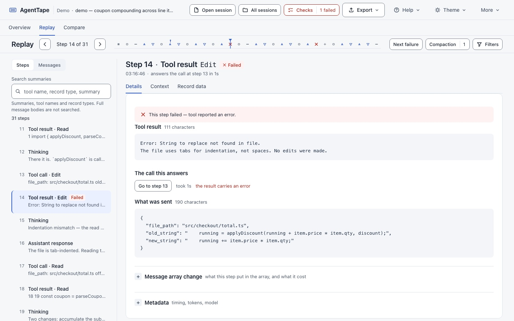

# AgentTape

[](https://github.com/renrenmimi/AgentTape/actions/workflows/ci.yml)

**AgentTape replays a Claude Code session that already happened, so you can see
where a run went wrong instead of inferring it from a chat log.** It reads the
transcript already sitting in `~/.claude/projects/` and shows you the messages
array as it grew, the one step that blew up the context, the tool that failed
and the forty minutes where nothing happened at all.



*The built-in demo tape, at the first failed tool call. The list on the left says what every step is; the panel shows the result that failed, the call it answers, and how long that call took. The overview this arrived from is one click away, and so is the context view that explains the +79k jump at step 12.*

Your transcripts never leave this machine. AgentTape opens a `.jsonl` from
`~/.claude/projects/` and parses it entirely in your browser: there is no
upload, no account, and no backend that receives transcript content. The only
network request the page can make goes to `127.0.0.1`, and only when the page
is itself being served from localhost. You can check that claim — `node
verify.mjs` asserts it against every source file in the repository.

---

## Why

When ordinary code has a bug you read the code, find the line, and fix it. When
an agent misbehaves the code is fine — the failure is somewhere in the *run*,
and the run is invisible. Scrolling a chat window will not show you:

- how the messages array grew, turn by turn
- which tool output blew up the context
- where the tokens actually went
- which step was the first one to go wrong

Every tool in this space — LangSmith, Langfuse, Braintrust, Arize Phoenix, W&B
Weave — needs you to instrument your code with their SDK **before** the run.
None of them can open a run that already happened, and none of them read Claude
Code's local transcripts. That gap is this project.

AgentTape is a sibling to [AgentLab](https://github.com/renrenmimi/AgentLab).
AgentLab teaches how an agent works using a hand-authored scenario; AgentTape
shows what an agent actually did, using real transcripts. Same mental model,
opposite direction — a cutaway model in a classroom, and a diagnostic tool in a
workshop. They share a visual language and no code.

## Getting started

```bash
npm install
npm run dev          # http://localhost:3000
```

Then drop a `.jsonl` on the page. That is the whole setup.

For a list of your own sessions without hunting through directories, run the
local helper in another terminal:

```bash
npm run helper       # or: node bin/agenttape.mjs
```

It prints an index of recent sessions and serves them to the page over
loopback. It does not serve the app — `npm run dev` already does that, and a
second way to serve it would only be a second path-resolution surface to get
wrong in a tool whose whole job is refusing to hand over the wrong file.

```
  #   project                                   session     size   lines  tools  modified
  ──────────────────────────────────────────────────────────────────────────────────────
  1   -Users-you-code-some-project              00000000  76.6 MB  10,757  2,660  2h ago
  2   -Users-you-code-another-one               11111111   5.4 MB   1,268    296  1d ago
```

Structure only. The helper never reads or prints a session title — titles are
generated from your prompts, so they leak exactly what this project exists to
protect.

**All sessions** has a **Look for it** button rather than probing for the helper
on every load: a refused connection to a port nothing is listening on is logged
in red by the browser before any JavaScript can catch it, and a working page
that prints a red error looks broken. Once the helper has answered here, the
page remembers and finds it on its own. Away from localhost that route says so
and makes no request at all, because a page on another origin cannot reach
`127.0.0.1` and telling you to start the helper anyway would be an instruction
that cannot work.

Not sure yet? Press **Try a demo**. It is a fictional run, invented end to end,
with two tool failures, a context blow-up, a compaction, a delegated run and a
38-minute idle gap in it.

It is also live at **<https://agenttape.vercel.app>** — drag a transcript onto
that page and it is parsed in your browser, exactly as it is locally.
[`docs/deploy.md`](docs/deploy.md) has the steps that produced it and the
measured list of what a deployed build loses (the helper, and nothing else).

### Checking a run from the command line

The one command worth learning, and the only one that needs no browser:

```bash
node bin/agenttape.mjs check examples/lenient.rules.json path/to/session.jsonl
```

**Node 22.18 or newer** — `check` reads the parser as TypeScript directly, and
that stopped needing a flag in 22.18. Nothing to install and nothing on npm:
clone the repository and run the file. `node bin/agenttape.mjs --help` prints
the rest.

It exits `0` when every rule held, `1` when one failed, `2` when the rule set or
the tape could not be read — which is what lets it sit in a CI job and tell you
the day your agent stopped searching before it wrote. Run with **no arguments at
all** and it does something different: it lists your recent sessions and starts
the loopback helper described above, so use `check` explicitly.

Two rule sets to copy, in [`examples/`](examples/):

| | |
| --- | --- |
| [`lenient.rules.json`](examples/lenient.rules.json) | A floor, not a standard: it ended broken, it looped, it hit a context wall, or a tool hung. Start here. |
| [`strict.rules.json`](examples/strict.rules.json) | What a run you intend to trust looks like, including *read before edit* and *search before write*. |

Both hold on a run that went well; on a run that did not, the strict set catches
strictly more. That ordering is asserted in `verify.mjs` by running them, not by
comparing the numbers in the files.

When a rule fails, the output ends with a block delimited by `── copy from
here ──`. It is Markdown, it names the rule, what happened and the step, and it
carries no message text — every word in it was written by this program from a
fixed vocabulary. Paste it into an issue as it stands. Add `--json` for the same
result as a machine-readable object on stdout, with complaints kept on stderr.

A redacted `.tape.json` checks exactly as the transcript it came from: no rule
reads a message body. You can hand somebody a structure-only tape and they can
check your expectations against it without ever seeing what was said. The full
rule reference is [`docs/rules.md`](docs/rules.md).

## What it shows

Three views over one session, and you arrive at the first of them whichever way
you came in.

### Overview — what happened, and where to look

Three figures, a sentence built from the counts (`31 steps · 9 tool calls ·
2 tool failures · 1 compaction`), and a list of **key events** that each go
somewhere: every failed tool call, the largest observed increase in context,
each compaction, each delegated run, the longest gap between records.

The list is an index, not a summary. It ranks nothing and concludes nothing,
because the transcript records what was said and done and not what anybody
meant. A run with no failures in it says *no failed tool calls recorded* — the
absence of a recorded failure, which is not the same statement as success, and
the page does not make the second one.

What a record is missing is stated rather than implied. A session with a
delegated run whose file you have not opened says so on this page, because
`isSidechain` is false on every record of a main transcript and nothing else in
the file would tell you.

**Session details** holds everything else — wall clock and active time, idle
gaps, tokens in and out, cache reads, peak context, models, the file's own size
and line count, the writer versions and the per-tool breakdown. It is one
control away rather than the first thing on screen, which is the change: those
figures used to be a strip of twelve above every other view, where they were
navigation nobody could navigate by.

### Replay — one step at a time

A list of steps on the left and one panel on the right.

Every row in the list says what its step **is**, in task language: `Tool call ·
Read`, `Tool result · Read`, `Assistant response`, `Thinking`, `Context
compaction`. A `tool_result` carries no tool name of its own — the name is on
the call — so the list resolves it through the pair map rather than leaving you
to do it. That naming is a presentation layer: the record's own `type` and
`role` are untouched underneath, and Record data shows them.

The list is virtualised. At step 5,900 of a six-thousand-step session it holds
about fifteen rows.

Above it, a thirty-pixel **position rail**: one tick per step, the shape
encoding the kind, failures marked in a different shape as well as a different
colour, delegations flagged. It is the one thing a list is bad at — where in
the run you are, and how the failures are distributed — and it is a strip
rather than the eighty-four pixels of instrument it replaces.

Drag it, or use the keyboard. Press <kbd>?</kbd> for the whole list: arrows to
step, `Shift` for ten at a time, `PgUp` / `PgDn` for fifty, `Home` / `End` for
the ends, `n` / `p` for the next and previous failure — or match, while a
filter is on — `/` for the search box, `c` to compare, `a` for checks, `Esc` to
close whatever is open. The list, the rail and the context chart each own their
own arrow keys, so a key pressed in one of them moves the playhead once.

The panel has three subviews, and all three stay on the step you are on.

**Details** leads with the content: the tool input, or the text. Then the other
half of the exchange, with a control that goes to it and the wall-clock time
between the two — and four distinguishable states rather than one shrug, since
*returned in 1.2 s*, *no result recorded*, *the result carries an error* and
*answers the call at step 6* are four different facts. The array delta and the
metadata are each behind a control, because they answer a second question and
used to sit between the reader and the first one.

**Context** plots `input_tokens + cache_read_input_tokens` per step, with axes
that have units on them and a selection that moves with the keyboard. It exists
for one shape: a step pushes a large payload into the array, the line steps up,
and every turn after it pays to re-send that payload. The largest single-step
increase is marked; so are compact boundaries, so the drop after one reads as
an event rather than a glitch.

Marking the increase is half an answer, so a line says what became of the
payload: *context never fell back below that level in the 18 steps that
followed, and 4 model turns re-sent it, 314k of re-reading*, or *the level fell
at the compaction 28 steps later, which the writer recorded*, or — when the
context fell and nothing explains it — it reports the fall and declines to
explain it. Context is one number per turn, not an inventory, so the index
cannot prove a particular payload is still present, only that the level never
fell back; the line says which of those it is doing. It also says the increase
was *reported* at that step rather than caused by it, because a rise recorded
on a thinking record is a rise recorded on a thinking record.

The elapsed-time axis lives here too, next to the wall-clock and active
durations it is the picture of, so a 38-minute pause reads as a 38-minute pause
instead of being flattened into the next tick.

**Record data** shows the record in the file's own vocabulary — its `type`, its
`role`, its place in the messages array — then the **parsed record**, which is
this application's projection under the names it gave, and then the **raw
record**, which is the line read back from the same bytes the index points at.
The two names mean two different things and neither pretends to be the other: a
session opened from a `.tape.json` has no original line and says so, rather
than re-serialising the projection and calling it the source.

The left column also has a second mode. **Messages** is the array as it stood at
the playhead: entries appear as they were added, assistant blocks that share a
`message.id` grouped into one entry because that is one API message even though
the transcript writes it as several lines, each block linking back to the step
it is. It follows the playhead unless you turn that off.

**Search and filters.** Dragging is not a query, and five thousand turns is too
many to find anything in by hand. The search box sits directly above the list it
searches, and says what it covers: it reads the 96-character summaries the index
already holds and **never the bodies**, because reading bodies would pull the
transcript back into memory and undo the design the rest of this is built on. A
search that quietly misses matches is worse than one that states what it covers.

Tool names and a payload-size threshold are behind a **Filters** control, and
whatever is in force is a row of chips that is always on screen with a way to
take each one off. Non-matching steps are **dimmed, not removed**, so the
position and density of the run stay honest. Where the rail is denser than the
screen, the dim base is every step and the height of the bright bar is the share
of that column that matched — a filtered rail is a density plot, not a blanket.
A playhead that stops matching is left where it is and labelled, never jumped.
A filter that matches nothing says *No matching steps*, says how many steps the
session still has, and leaves the panel you were reading alone.

**Delegated work.** When a session hands a job to a subagent with the `Agent`
tool, the transcript keeps the call and the summary that came back; everything
the subagent did is in a separate file. In the largest session this was built
against, a quarter of all tool calls were invisible. Delegated steps are flagged
in the list, the overview counts them, and the step says in words that the work
exists and is not here. Drop the `agent-*.jsonl` files alongside the transcript,
or open the session through the helper, and the run attaches to the call it
belongs to — exactly when there is a sidecar to say so, and by the window
between the call and its result when there is not, which the panel reports as
the evidence it is. Open one and you get the replay again pointed at the
subagent's own tape, with a breadcrumb and a way back to the parent step. One
delegated run in the corpus this was built against makes 130 tool calls; that is
a session, not a footnote.

Drops are taken at any time, not only on the landing page. A subagent file pairs
into the run on screen; a transcript asks whether to open it or compare with it.

### Compare — two runs, and what is actually being compared

A view of its own rather than a modal over a workbench you cannot see, so run A
stays open behind it and coming back does not reload anything.

Each run is reduced to the tools it called, in order, and those two lists are
compared. **Message contents are not compared** — two runs of the same task
differ in almost every word, so comparing text answers "they diverged at step 2"
every time. The cost of that rule is that alignment is positional: one extra
call early in a run shifts everything after it, and the panel says so out loud
rather than presenting a shift as a fork. The divergence is marked on both
rails, which share one scale so a shorter run stops short instead of being
stretched to match.

## Checks

State what a run was supposed to do — `Grep happens before Write`, `context
never exceeds 200,000 tokens`, `no tool is called more than five times in a
row`, `no tool call takes longer than 120 seconds`, `the run ends without an
error` — and each one is reported with the offending step linked.

Three outcomes, not two. **Passed** is only for a check that had something to
check; a check with nothing to check — no call to the tool it names, no context
figures at all — is **not evaluated**, because "nothing violated this" and "this
was never tested" are different facts and the second dressed as the first is how
a suite stops meaning anything. And passing is a statement about the conditions
you set, not about whether the session did the right thing; the panel says that
in its own words.

Results first, editing behind a control. Loading a rule set that has problems in
it replaces nothing until you say so, so a typo in rule three does not cost you
rules four through nine.

Save the set and it leaves the browser:

```bash
node bin/agenttape.mjs check expectations.rules.json session.jsonl
```

One line per rule, and **exit 1 when any of them failed** — which is what puts
it in a CI job and tells you the day your agent stopped searching before it
wrote. The file format is documented in [`docs/rules.md`](docs/rules.md). This
repository runs the checker against itself on every push, against two invented
runs committed under `fixtures/`, one that meets the expectations and one that
breaks all five.

Every rule reads the index and none reads a body, so a redacted tape can be
asserted against exactly as well as the transcript it came from.

## Export

Two actions, each named for what it does rather than for the noun it produces.

**Copy Markdown summary** puts the counts, the tool breakdown, every failure
with its step number, the context profile as a sparkline, the compactions, the
delegated runs and any check that did not hold on the clipboard. Structure and
numbers only — no message text — so it is safe to paste into an issue by
construction rather than by care. If the browser refuses clipboard access the
text is shown for you to copy, rather than a toast claiming a copy that did not
happen.

**Download redacted tape** is described below.

## Every session at once

**All sessions** is a table of the sessions from a folder you grant this page
access to, or from the local helper: steps, tool failures and active time by
default, with tool calls, wall clock, peak context, compactions, delegations,
size and a context sparkline available from a **Columns** control or by
expanding a row. Sparklines share one vertical scale, so the session that grew
the most context is the tallest line. Click through to open one; the session you
already had open is still open behind it.

There is no title column and no first message. Both are written from prompts. A
session there is a project directory, an id and a clock.

## Colour, and how it is checked

Every colour in the interface is a role in one token file, and every pair that
carries text is measured against the surface it is actually painted on:

```bash
node scripts/contrast.mjs
```

88 pairs, body text held to 4.5:1 and control edges and graph marks to 3:1, in
both themes. `node verify.mjs` runs the same measurement, and refuses a hex
value or an `opacity` dim in a component style — either is a colour no
measurement can find, which is how an unreadable grey survives a review.

Light is the default for a first visitor and dark is a choice, alongside
*system*, which keeps tracking the operating system for as long as it is
selected. A preference already stored on your machine still wins over the
default.


## Redaction

**Download redacted tape** produces a `.tape.json` that is safe to attach to a
GitHub issue. It keeps step order, roles, tool names, timings, token counts,
error flags, block types and the *length in characters* of every body. It
replaces every text body, tool input, tool result, file path and URL with a
placeholder that states its length. Correlation ids — `tool_use` ids and
message ids — are renumbered within the tape (`t7`, `m12`) rather than carried,
because agents quote their own tool ids inside message text:

```json
{"k":"tool-result","y":"user","ts":1776...,"e":1,"w":"tool reported an error",
 "u":"t7","x":98600,"c":8420,"b":0,"p":"[result 8,420 chars]"}
```

The design is subtractive rather than filtering. The redactor is never handed
the transcript: it reads the in-memory index, which holds numbers, enumerated
writer vocabulary and exactly one content-bearing field, and it replaces that
field. `tape.body()` — the one function that can reach the file — is not called
on that path. A second pass then re-checks the finished object slot by slot,
and `verify.mjs` asserts that no twelve-character run from any body survives.

AgentTape loads a `.tape.json` as readily as a raw `.jsonl`, so a redacted tape
is something you can send to somebody and have them open.

## Testing

```bash
node verify.mjs                              # static checks
npm run counters                             # break the counting on purpose
npm run build && npx next start -p 3000 &    # then, in another terminal:
npm run selftest                             # the in-page suite, in a real browser
```

`npm run selftest` needs Chrome and finds it through `CHROME_PATH` or the usual
names on `PATH`. It has no dependencies: Node 22 has a built-in `WebSocket` and
Chrome speaks the DevTools Protocol over it, so the whole driver is
[`scripts/selftest.mjs`](scripts/selftest.mjs). Add `--helper` to run the four
assertions that need the local helper; without it they are reported as *not run
here*, counted in the denominator and outside the pass count, the way
`agenttape check` treats a vacuous rule.

For the page on its own, `npm run dev` and open
`http://localhost:3000/?selftest=1`.

`verify.mjs` imports the parser and the redactor as modules and runs them
against fixtures generated in code — never against a real transcript, because a
checker that needs one of my sessions is a checker nobody else can run. It
covers every documented record type, unknown types degrading to a generic step,
missing `usage`, malformed JSON mid-file, byte offsets across multi-byte
characters, filtering in each dimension and in combination, the step delta, the
context-jump trace, delegation detection and subagent pairing, run comparison
including its degenerate cases, every assertion rule in both directions, rule-set
parsing and its seven distinct failures, and the twelve-character redaction test.

Three of its checks are behavioural privacy tests built the same way: take a
transcript in which every text field is one distinctive marker, produce the
artefact from it — the statistics record, the pasteable report, a redacted tape
— and assert the marker does not come out, *and* that the marker really was in
the index it was built from, so the test cannot pass vacuously. It also asserts the
repository's own guarantees: the ignore rules, the absence of any remote host,
that nothing lands on `window` outside the self-test flag, that the search path
never reaches for a body, and that the helper only points at directories this
repository can produce.

`?selftest=1` asserts against the live DOM: the timeline paints one tick per
step, filtering dims that tick rather than deleting it, keyboard navigation
moves the playhead, `n` steps to the next match while a filter is on, a
playhead that stops matching is not moved, a delegated step says its work is
elsewhere, the comparison states its alignment rule, an assertion links its
offending step, `?` lists the shortcuts and Tab stays inside a dialog, the
messages panel stays virtualised on a six-thousand-step tape, failure is stated
in words as well as in colour, every control is keyboard-reachable and named,
and the stylesheet honours `prefers-reduced-motion`.

CI also runs the rule checker against two committed fixture tapes, one that
meets its expectations and one that breaks all five, so the non-zero exit is
demonstrated rather than described.

### What a green tick covers

Every push, on every pull request:

| | |
| --- | --- |
| `node verify.mjs` | 684 assertions over the parser, the redactor, the checker and this repository's own guarantees |
| `npm run counters` | six self-inflicted breakages of the assertion counting, each required to be caught by the counter that should catch it, plus an unmutated copy required to come back clean |
| `npm run selftest` | the in-page suite, 353 assertions against a live DOM in a real browser, in no-helper mode, against a production build the job served itself |
| `agenttape check` | the rule checker against two committed fixture tapes, one that meets its expectations and one that breaks all five, so the non-zero exit is demonstrated rather than described |

The in-page job asserts three numbers, not one — `349/353 passed · 0 failed ·
4 not run here` — and that it ran in the mode it asked for. Any of those moving
is a red build. It takes about fourteen seconds on a runner.

**Why three numbers and not one.** For two rounds this suite was red on `main`
while CI was green. Eighteen of its assertions were failing and every workflow
run passed, because CI did not open a browser and nothing else was looking. The
cause was not in the application: four concurrent copies of the suite were
running on one page, because it was scheduled inside an effect whose dependency
list was every piece of state on that page — the suite changed state, the effect
re-ran, and four hundred milliseconds later another copy started.

The diagnosis did not come from reading the code. It came from sampling the
playhead position every frame and seeing it read 247 on a thirty-one step tape.
Four attempted repairs before that each produced a different arbitrary number,
because each of them changed the phasing of four interleaved runs rather than
fixing anything.

That paragraph is the reason to trust the table above it.

### Where this stands

[`docs/state.md`](docs/state.md) records where the project stopped: what is
verified by what, the four things it does not do, and the two rounds when this
suite was red on `main` while CI was green. The verification work is finished.

### On the sibling project

AgentTape and [AgentLab](https://github.com/renrenmimi/AgentLab) each keep their
own driver. Two repositories cannot share a file without a dependency or a
submodule and neither is worth it for two hundred lines. What they share is the
shape and the contract — `CHROME_PATH` or the usual names on `PATH`, an explicit
port, a non-zero exit, totals asserted rather than eyeballed — which is all the
sharing that was ever actually needed.

## Privacy

1. No transcript, and no excerpt of one, is committed. `.gitignore` refuses
   `*.jsonl` at the root, `fixtures/real/`, and every `*.tape.json` except the
   demo.
2. Parsing happens in the browser. There is no upload endpoint anywhere in this
   repository.
3. The helper binds to `127.0.0.1` only, serves `GET` only, refuses any path
   that does not resolve inside `~/.claude/projects`, refuses symlinks out of
   that tree, and checks the `Host` header so a rebinding attack cannot reach
   it from a page you did not open.
4. `docs/format-notes.md` records the transcript format as key names, counts
   and byte sizes. No message text went into it.

## How it handles a 76 MB file

The transcript is never held as a string and never as an array of parsed
records. It is walked one megabyte at a time straight out of the `Blob`, each
chunk scanned for newline *bytes* so line offsets are exact, and each line
indexed into a flat row of mostly-numeric fields and then discarded. Bodies are
re-read from those byte offsets when the playhead asks for one.

The largest single line in the sessions this was built against is 1.34 MB.
Expanding it reveals two kilobytes, then more in bounded windows; past a quarter
of a megabyte the offer changes to a download, because a megabyte of text nodes
would stall the tab.

## One line is one block, not one message

This is the finding that overturned the design, and it is worth stating on its
own because it decides the shape of two of the panels.

A Claude Code transcript does not write an API message per line. It writes a
content **block** per line: in the largest probe fixture, 6,949 of 6,951
array-valued `message.content` fields hold exactly one block, and consecutive
`assistant` records that share a `message.id` are one API message split across
several lines — thinking on one line, prose on the next, the tool call on a
third.

The original assumption was one line, one message. Designing against that would
have produced a messages panel claiming three turns where the API saw one, and
token costs attributed to the wrong rows.

So the two panels disagree deliberately:

- **the timeline is per block**, because a block is the smallest thing that
  happened and the smallest thing you can put a playhead on;
- **the messages panel groups back up by `message.id`**, because that is the
  array the model was actually sent.

The array delta keeps the distinction visible: the first line of a group says
`entry 6`, the next two say `a block to entry 6`.

A consequence worth knowing: no assistant record in any fixture mixed prose with
a tool call, and none held two `tool_use` blocks. Parallel tool calls appear as
consecutive lines sharing one `message.id`.

[`docs/format-notes.md`](docs/format-notes.md) is the full reference — record
types, `usage`, the four signals that mean a step failed, how subagents link
back to their parent, and which fields are version-dependent. Nobody appears to
have written the format down publicly, so it is written for a stranger rather
than for me.

## Limits

A tool that states its limits is easier to trust than one that implies it has
none. These are the ones worth knowing before you rely on an answer.

**Search matches summaries, not full text.** The index keeps a 96-character
summary of each step and that is what search reads. A word that appears only in
the ninetieth line of a tool result will not be found. This is deliberate:
searching bodies means holding the transcript in memory, which is the thing the
whole design avoids. The control says so on its face rather than in this file.

**Comparison aligns by tool-call sequence, and positionally.** Two runs are
reduced to the tools they called and those lists are compared; message text is
never read, because two runs of the same task differ in almost every word and a
textual comparison would answer "step 2" every time.

Its blind spot follows from the rule. Two runs that call exactly the same tools
in exactly the same order are *identical* to it, however differently they went —
a run that read the wrong file and a run that read the right one look the same,
because both called `Read`. It can tell you where two runs stopped agreeing
about *what to do*; it cannot tell you which of them did it better. Positional
alignment costs the rest: one extra call early shifts everything after it. The
panel detects the common shapes — a swapped call, an insertion of one or two —
and says which it found, but past about eight calls of drift it stops trying and
says so. Only the first divergence is reported; there may be later ones.

**A nested subagent run shows less than a top-level one.** You get the replay:
its own step list, its messages array, its bodies, its context view and its
record data, all from the same components the parent uses. What you do not get
is the things that belong to the run you opened — the filter, the comparison,
the checks, the redaction export — and you do not get the runs *it* delegated in
turn. Open one of those as a transcript in its own right.

**A subagent file without its sidecar is paired by time.** The `.meta.json`
beside each run carries the id of the call that started it and is exact. Nothing
inside a subagent transcript points back at its parent, so a drag-and-drop
without the sidecars falls back to the clock: a subagent ran between its call
and that call's result. That identified all sixteen runs correctly in the
session this was built against, with no ambiguity — but two delegations running
in parallel would produce overlapping windows, and there the pairing declines to
guess and leaves the file unattached rather than hanging it on the wrong call.

**The format came from three transcripts.** Written by four writer versions, on
one machine, by one person. `docs/format-notes.md` records exactly what was
observed and what was not — `pr-link` and `atis-latch` are documented record
types that never appeared; `usage.output_tokens_details` appeared in one writer
version and none of the others. Somebody else's file will carry shapes this
parser has never seen. It is built to bend rather than break: every field is
optional, an unrecognised record type becomes a generic step, a malformed line
is skipped rather than aborting the file. But "it does not crash" is not the
same as "it understood", and a session from a much newer or much older Claude
Code may be read less well than these three were.

**A redacted tape keeps tool names.** That is on purpose — a run whose tool
names were stripped tells you nothing — but it means that if a model mentioned
a tool by name in its reasoning, that name survives into the export. The
twelve-character leak test in `verify.mjs` measures this rather than hiding it:
on the largest fixture, every surviving run of twelve characters is a tool name,
a JSON seam, or the export's own documentation prose, and none is in the
structural residue.

**A nested run is not the whole workbench.** Opening a delegated run gives
you its timeline, its messages and its bodies. It does not give you the filter,
the comparison, the assertions or the redaction export — those belong to the run
you opened — and it does not descend into runs it delegated in turn.

**Cross-session statistics come from the helper, or from a folder you grant.**
The table of every session is built either by the local helper walking
`~/.claude/projects`, or — with no helper at all — by the browser, once you
point it at that directory yourself. Both take the same code path and compute
the same statistics. The browser one is slower cold (2.51 s against the
helper's 1.99 s for 382 files) because it reads every file through the
sandbox rather than the filesystem, and it needs a secure context: on plain
HTTP `showDirectoryPicker` is absent and the `webkitdirectory` fallback takes
over. What the browser one cannot do is *open* a session by clicking a row —
that still needs the helper, because a granted folder gives statistics and the
row needs the file.

**The session index is cached, and the cache trusts size and mtime.** A
transcript is only ever appended to, so a file whose size and modification time
both match its cache entry is taken as unchanged. Something that rewrote a
transcript in place while preserving both would go unnoticed. The subagent list
is deliberately not cached, because those files appear and change without the
session's own size or mtime moving.

**An assertion can only be about shape.** Rules read tool names, timings, token
counts and error flags. `Grep happens before Write` is answerable; anything
about *what was said* is not, because nothing in the checker may read a body.
That boundary is what lets a rule set run against a scrubbed tape, and it is not
going to move.

**A report and a rule set carry tool names.** Both are meant to be shared, and
both keep the vocabulary that makes them useful — tool names, model ids, record
types. Neither carries a word of message text, which `verify.mjs` proves by
generating each from a transcript whose every text field is one distinctive
marker and asserting the marker does not come out.

**Wall-clock duration is usually not what you want.** Sessions are resumed for
days; one probe fixture spans 213 hours of wall-clock and holds about thirteen
hours of work. Active duration, which drops every gap over two minutes, sits
next to it for that reason.

**`next dev` and `next build` no longer share a directory.** Development writes
to `.next-dev`, `next build` and `next start` to `.next`, and `npm start` builds
before it starts — so a production server cannot come up on a directory that a
dev server rewrote underneath it. The failure this prevents reads as a corrupt
install rather than as a race, which is why it cost three rounds before it was
fixed; [`docs/build-directories.md`](docs/build-directories.md) is the paragraph
that would have saved them.

**The in-page suite has two modes and freezes both.** By default the four
assertions that need the local helper come back marked *not run here* — counted
in the denominator, outside the pass count, the way `agenttape check` treats a
vacuous rule. `npm run selftest -- --helper` asks for the other mode, and is
refused up front if nothing is answering on `127.0.0.1:4319`. Each mode declares
its total and its skip count, and a skip appearing where the mode does not
declare one is a failure: a suite that behaves differently depending on what
happens to be running on the machine cannot gate anything.

**The in-page suite covers what a browser can see, and nothing else.** It runs
in CI now, and what it asserts is the DOM: that a tick was painted, that a word
appears, that focus moved, that the messages panel stayed virtualised. It cannot
tell you whether the timeline is *legible*, whether the attribution line reads
as an explanation, or whether the comparison's caveat is understood. Four of its
353 assertions need the local helper and are marked *not run here* on a runner —
counted in the denominator, outside the pass count, so their absence is visible
rather than assumed.

**Deployment loses the helper and nothing else.** AgentTape is deployed at
<https://agenttape.vercel.app>. On a host that is not localhost the page never
attempts a `127.0.0.1` request at all, so the session list, opening a session by
row, and the helper-walked overview are gone; drag-and-drop, the demo, the
replay, the filter, the comparison, the checks, the redacted export, the
report and `/format` all work, as does the folder-granted overview. Measured
against a production build served from a non-localhost origin, where the only
host contacted was the origin itself. [`docs/deploy.md`](docs/deploy.md)
has the settings and the numbers.

**The format reference is generated from one file.** `/format` renders
`docs/format-notes.md` at build time through a 200-line Markdown reader written
for this, because a Markdown library would have been a fourth runtime
dependency. It handles headings, paragraphs, lists, code, tables and rules, and
nothing else — no images, no footnotes, no nested lists, no HTML passthrough.
`verify.mjs` asserts the page renders that file rather than a second copy of
the prose, which is what stops the two from drifting: there is only ever one.

## Roadmap

Out of scope, in rough order of how much I want them. Each line says why it is
still out, because "not yet" without a reason is just a wish.

- **Nesting past one level.** *A delegated run can be stepped through now, but
  a delegated run that delegates in turn is still a summary inside a summary.*
  Every run in the corpus has `spawnDepth: 1`, so this has never mattered here;
  it will matter the first time somebody's agent nests deeper, and the fix is a
  breadcrumb rather than another overlay.
- **Realigning a comparison after the divergence.** *The rule reports the first
  place two runs part and detects a swap or a short insertion; past that it
  stops.* A proper longest-common-subsequence alignment would keep the two runs
  side by side all the way down, at the cost of a rule that is much harder to
  put in one sentence above the result — and a rule the reader cannot state is
  worse than a limited one they can.
- **A rule that can be about a tool's arguments.** *Rules read tool names and
  numbers; nothing reads a body, which is what lets a rule set run against a
  scrubbed tape.* "Never run `rm -rf` outside the working directory" is a real
  expectation and it needs the input. It would need a second class of rule that
  a scrubbed tape cannot answer, and saying which rules a given tape can and
  cannot check is the design problem, not the matching.
- **Live recording while an agent runs**, rather than after the fact.
  *Deferred because tailing a file that is being appended to means handling
  half-written lines and a moving end, and the whole value of this tool so far
  is that it needs nothing set up before the run.*
- **Formats other than Claude Code** — OpenAI and LangChain adapters.
  *Deferred until the Claude Code reader has been wrong a few more times.* The
  index is already format-agnostic — steps, entries, tokens, tools — so an
  adapter is a parser and nothing else; the risk is generalising the shape
  before the one format I can actually check has stopped surprising me. It has
  surprised me repeatedly — block-per-line, `is_error` usually absent,
  `tool_result.content` sometimes an array, timestamps that step backwards, and
  a model id that is not a model. [`docs/format-notes.md`](docs/format-notes.md)
  is the running tally.

## Repository

```
app/       the Next.js app — no UI library, no CSS framework, no state library
           tokens.css is every colour in it, once, by role
lib/       parser, tape container, redactor, summary, filter, step delta,
           key events, step names, subagents, comparison, rule checker,
           session statistics, report
fixtures/  invented runs and a rule set, so CI can check itself
bin/       the local helper and the command line
docs/      what the transcript format actually is, and the rule-set format
scripts/   builds the demo tape, measures the palette, breaks the counters
verify.mjs static checks
```

Three runtime dependencies: `next`, `react`, `react-dom`. Same as AgentLab.

© 2026 Weiren Feng. All rights reserved.
